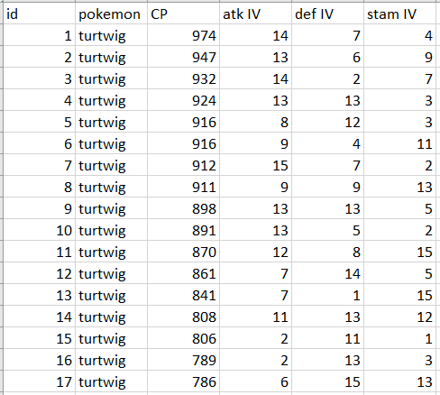
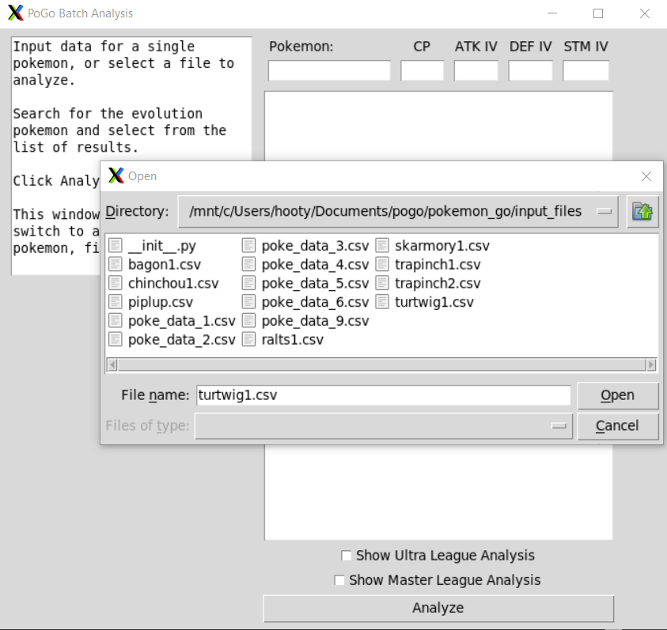
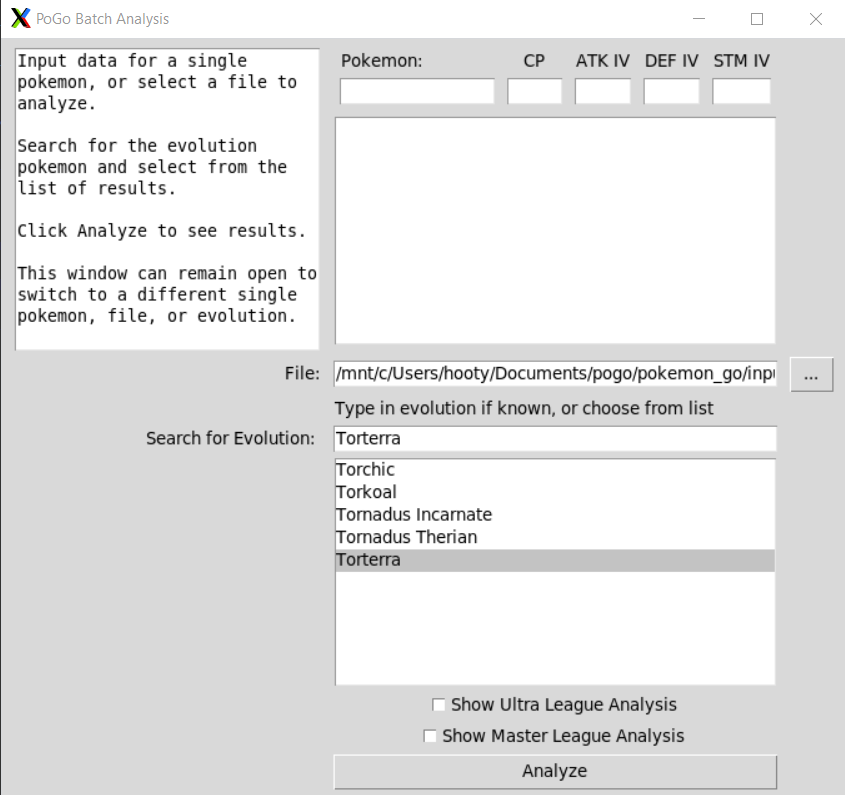
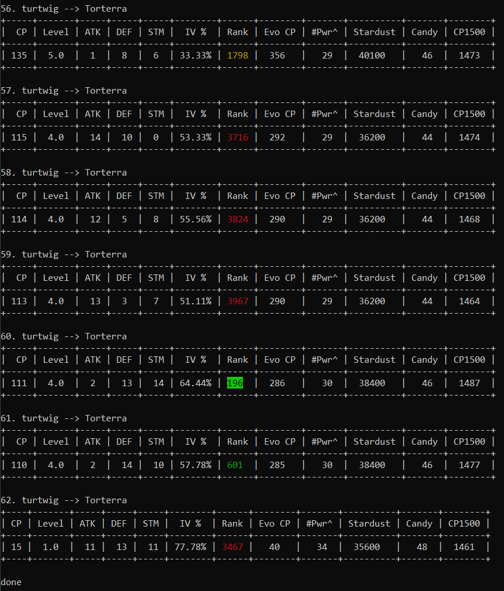
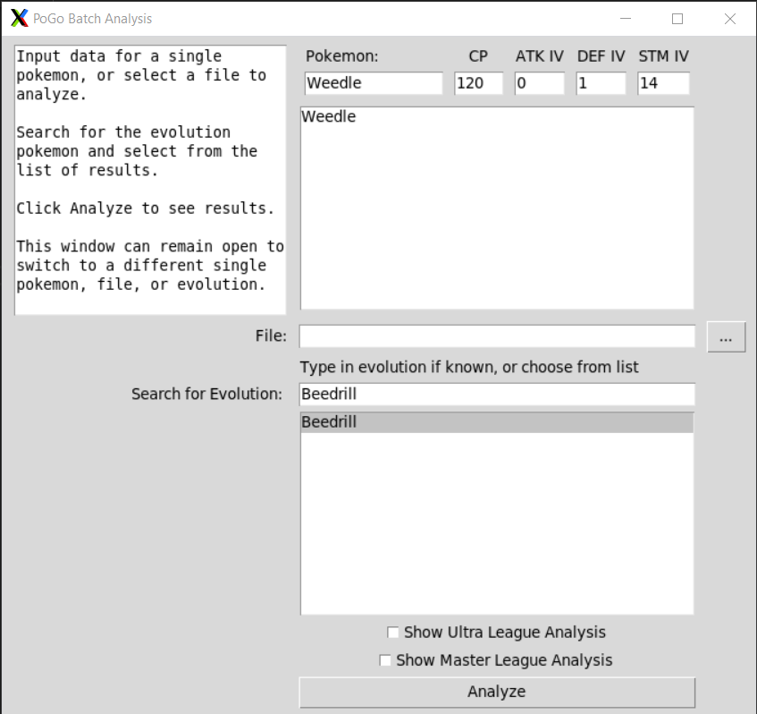
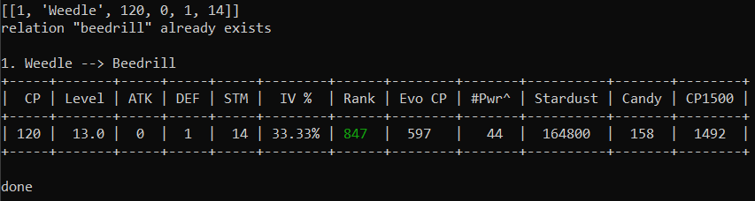
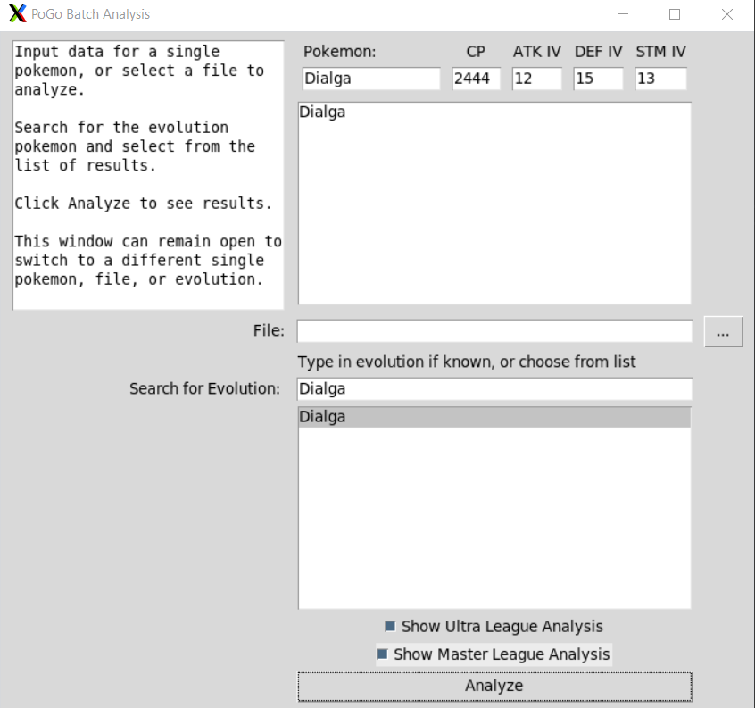
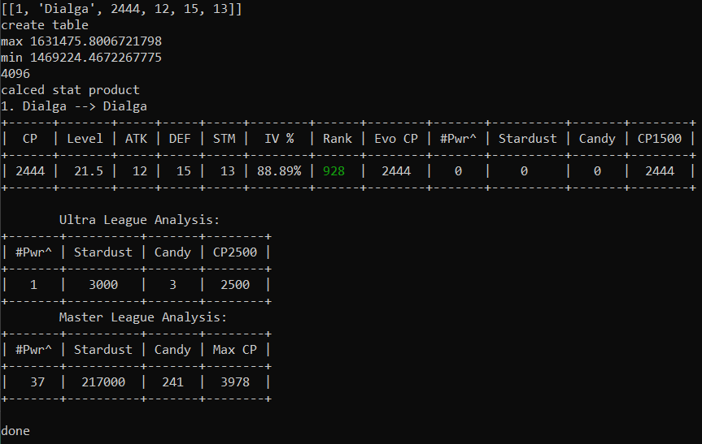

# pokemon_go

This repository stores files for calculating the evolution CP, PVP stat product rank, and power up costs for a batch of Pokemon. Super useful during Community Day to quickly figure out which Pokemon to keep or transfer to free up storage space!

Stat Product is a widely-used metric for predicting a Pokemon's effectiveness in PVP that is based on their IV's and base stats.

The easiest way to use this program is through the GUI in the `scripts` directory, `pogo_gui.py`. Input a CSV file with multiple entries of the same Pokemon into the GUI and see the results in the terminal.

### Batch Analysis
A CSV file with 62 Turtwig entries:  
   
Choose the file in the GUI:  
   
Choose the evolution Pokemon. In this case, Torterra:
   
See the results in the terminal:  
   

### Single Pokemon Analysis
Alternatively, you can analyze a single Pokemon in the GUI. Enter the species, CP, and IVs, and choose the evolution:  
   
See the results in the terminal:  

### Ultra & Master League Analysis
Calculate stardust and candy powerup costs for Ultra League and Master League:
   
See the results in the terminal:  
   

If you want to use the command line interface, run `multi_poke_v1.py` or `read_many_files.py`. More info below!

Pokemon stats (name, CP, IVs) are written in a CSV file and read by `multi_poke_v1.py`.
If multiple CSV files are to be analyzed, read_many_files.py can be used.

## Output in terminal window
### Great League Analysis
* CP: the original Pokemon's CP  
* ATK: attack IV
* DEF: defense IV
* STM: stamina IV
* IV %: based off of perfect IV's of 15/15/15
* Level: the original Pokemon's level
* Rank: evolved Pokemon's Great League PVP rank, based on the stat product  
* Evo CP: the CP the Pokemon will have when evolved
* #Pwr^: number of power ups needed for evolved Pokemon to reach CP1500  
* Stardust: after evolution, the amount of stardust needed to reach CP1500
* Candy: after evolution, the amount of candy needed to reach CP1500
* CP1500: the highest CP closest to 1500 that the evolved Pokemon will reach  
### Ultra League Analysis
* #Pwr^: number of power ups needed for evolved Pokemon to reach CP2500
* Stardust: after evolution, the amount of stardust needed to reach CP2500
* Candy: after evolution, the amount of candy needed to reach CP2500
* CP2500: the highest CP closest to 2500 that the evolved Pokemon will reach
### Master League Analysis
* #Pwr^: number of power ups needed for evolved Pokemon to reach max CP
* Stardust: after evolution, the amount of stardust needed to reach Max CP
* Candy: after evolution, the amount of candy needed to reach Max CP
* Max CP: the max CP that the evolved Pokemon will reach

## Missing Features
Things I need to add/fix:
* Best buddy boost
* Lucky Pokemon stardust discount
* 9% CP reduction on certain Pokemon (ex. Mewtwo)
* Galarian Pokemon base stats

## Technologies Used
PostgreSQL, psycopg2, python3

## Installation
Install PostgreSQL. Follow directions for your OS here: https://www.postgresql.org/download/

Install the requirements using the `requirements.txt` file:  
`$ pip install -r requirements.txt`

### Setting up the database
Create a database called `mydb`:  
`$ createdb mydb`

Create a table in the database called `base_stats`  
`$ psql mydb -c 'create table base_stats(id varchar, species varchar, hp int, attack int, defense int);'`

Populate the table with base stats from pogostats_csv.csv  
`$ psql mydb -c "\copy base_stats FROM 'pogostats_csv.csv' (format csv, header true);"`

### Updating Base Stats
Run the bash file called `update_base_stats.sh`. Enable permissions:  
`$ chmod +x script.sh`  
`$ ./scripts/update_base_stats.sh`

### Creating the input file
Create a csv file with the following columns: id, Pokemon, CP, attack IV, defense IV, stamina IV. Save it in the same directory as multi_poke_v1.py.

It's highly recommended to analyze one type of Pokemon. The names of the columns don't matter, but the order does.  

| id | Pokemon | CP | Atk IV | Def IV | Stam IV|
| ------ | ------ | ------ | ------ | ------ | ------ |
| 1 | bagon | 327 | 1 | 14 | 15 |

### Running the program
To use the command line interface, run `scripts/read_many_files.py`. You can place your input files anywhere, as long as you call the correct path.

Analyzing one file in the root directory:  
`$ python3 scripts/read_many_files.py bagon1.csv`

Analyzing one file in a sub-directory:  
`$ python3 scripts/read_many_files.py input_files/bagon1.csv`

Analyzing many files:  
`$ python3 scripts/read_many_files.py bagon1.csv bagon2.csv bagon3.csv`

Analyzing one file and specifying evolution Pokemon:  
`$ python3 scripts/read_many_files.py salamence bagon1.csv`

### Specifying the evolution Pokemon
If you didn't specify an evolution in the command line arguments, the program will ask for an evolution Pokemon. Type in the Pokemon's name (ex. shelgon) and press enter for the analysis. Don't worry about capitalization. If you misspell the name, the program will safely exit.
